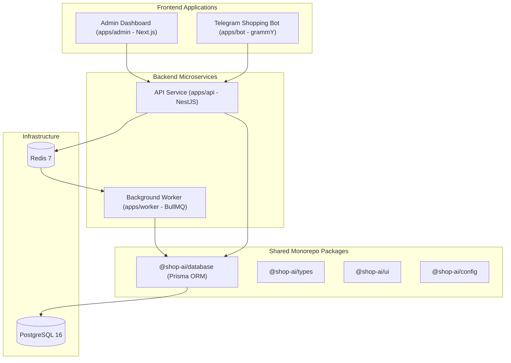

# System Architecture Documentation

Welcome to the **Shop AI Manager** architectural documentation.

For detailed AI and developer context, refer to the following guides:

- 📐 [Overview & System Topology](file:///Users/mac/Desktop/projects/shop-ai-manager/docs/ai-context/overview.md)
- ⚙️ [Backend NestJS Architecture](file:///Users/mac/Desktop/projects/shop-ai-manager/docs/ai-context/backend.md)
- 🧩 [Architectural Patterns & Data Flows](file:///Users/mac/Desktop/projects/shop-ai-manager/docs/ai-context/patterns-and-data-flow.md)
- 🛡️ [Technical Guidelines & Boundaries](file:///Users/mac/Desktop/projects/shop-ai-manager/docs/ai-context/technical-guidelines.md)

---

## High-Level System Overview

