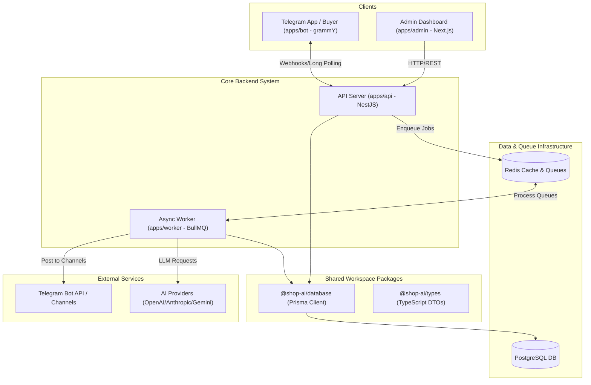

# Project Overview: Shop AI Manager

## 1. Introduction
**Shop AI Manager** is a high-performance, multi-channel AI-powered e-commerce and store management SaaS platform. It combines a Next.js Admin Panel, NestJS REST API, grammY Telegram Bot, automated Telegram Channel Publisher, background processing worker, and AI assistant capabilities.

## 2. Core Business & Technical Goals
- **AI Automation**: Auto-generate product descriptions, AI customer support, smart product tagging, and channel content generation.
- **Telegram Ecosystem Integration**: Direct store shopping via Telegram Bot, multi-channel auto-publishing, and customer CRM linking.
- **Modular Monorepo Architecture**: Clean separation of applications (`apps/`) and shared packages (`packages/`).
- **High Scalability & Reliability**: Asynchronous background queue processing (`apps/worker` + Redis/BullMQ) to protect HTTP API responsiveness from rate limits and LLM latency.
- **Multi-Tenancy Readiness**: Isolated store management, RBAC, and data integrity.

## 3. Technology Stack
- **Monorepo Engine**: [Turborepo](https://turbo.build/) + [pnpm](https://pnpm.io/)
- **Backend API**: [NestJS](https://nestjs.com/) (Node.js framework, TypeScript)
- **Frontend Dashboard**: [Next.js](https://nextjs.org/) (App Router, React 18/19, Tailwind CSS)
- **Telegram Bot**: [grammY](https://grammy.dev/)
- **Background Worker**: Node.js + BullMQ + Redis
- **Database & ORM**: PostgreSQL + [Prisma ORM](https://www.prisma.io/) (isolated in `@shop-ai/database`)
- **Caching & Queues**: Redis 7
- **AI Integration**: OpenAI / Anthropic / Gemini API Adapters

## 4. Monorepo Structure
```
shop-ai-manager/
├── apps/
│   ├── admin/          # Next.js 14 Admin Dashboard
│   ├── api/            # NestJS REST/GraphQL API Server
│   ├── bot/            # grammY Telegram Shopping Bot
│   └── worker/         # Async Queue Worker (AI, Notifications, Channel Publishing)
├── packages/
│   ├── config/         # Shared TypeScript configurations
│   ├── database/       # Shared Prisma Schema, Migrations & PrismaClient (@shop-ai/database)
│   ├── types/          # Shared DTOs, interfaces, and TypeScript contracts (@shop-ai/types)
│   └── ui/             # Shared UI Component Library (@shop-ai/ui)
├── docker/             # Dockerfiles for all microservices
├── docs/               # System architecture & AI Context documentation
└── docker-compose.yml  # Local dev stack (Postgres + Redis + Apps)
```

## 5. System Architecture Graph (Mermaid)

